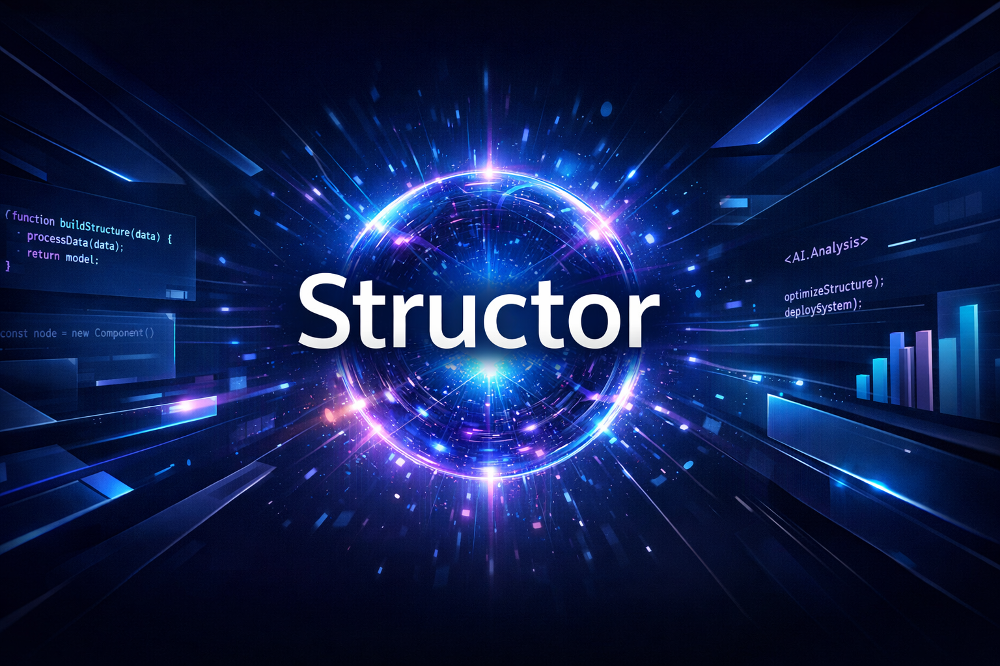

# Structor



Structor is a professional headless console UI and AI bridge designed for advanced aesthetics and seamless AI integration. It provides a powerful terminal-based interface for interacting with various AI providers and managing your HeHo environment.

## 🚀 Features

-   **Professional Terminal UI:** Sleek ASCII art splash screen and interactive command center powered by `rich` and `InquirerPy`.
-   **AI Provider Management:** Seamlessly switch between **OpenRouter** and **Puter** for your AI needs.
-   **HeHo API Integration:** Built-in support for HeHo API keys, allowing the AI to perform tasks within your HeHo account.
-   **Open Interpreter Integration:** Run a powerful AI interpreter directly in your terminal with custom system messages.
-   **Secure Onboarding:** Integrated terms and conditions and local configuration management.

## 🛠 Installation

To run Structor on your system:

1.  **Install Python:** Ensure you have Python 3.8+ installed.
2.  **Clone the Repository:**
    ```bash
    git clone https://github.com/appointeasedev-oss/Structor.git
    cd Structor
    ```
3.  **Install Dependencies:**
    ```bash
    pip install -r requirements.txt
    ```
4.  **Run Structor:**
    ```bash
    python main.py
    ```

## 🔑 Configuration

Structor stores its configuration locally in `~/.structor/config.json`. You can configure your AI providers and HeHo API key directly through the Command Center.

### HeHo API Support
If a HeHo API key is set, Structor automatically injects it into the environment and informs the AI about its availability, enabling autonomous tasks within the HeHo ecosystem.

## 📄 License

This project is provided "as-is" without warranty. Use responsibly and ethically.
